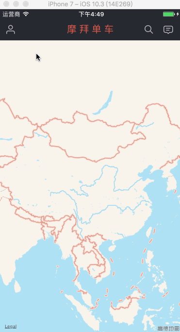

# JYJSlideMenuController
一款不一样的侧滑菜单

# GIF


# message
 `JYJSlideMenuController ` 模仿摩拜侧滑导航栏，既然都是共享单车，为什么侧滑菜单不拿出来共享呢

# Usage
 `JYJSlideMenuController ` 很简单，利用系统的导航栏，带有UIBarButtonItem慢慢出现的效果，省去自定义的麻烦。下来接下来我讲解具体实现大致步骤：

侧滑栏有右半部分是透明的，可以看到下面。经过思考，觉得是窗口window。 设置window的跟控制器为导航控制器`window_.rootViewController = nav;`.整个过程还是用的系统的导航栏不用自定义

1、添加手势。手势选用很有讲解，仔细观察摩拜，屏幕边缘也有手势，用的就是 `UIScreenEdgePanGestureRecognizer`，然而有地图的存在，根本不起作用。怎么办呢？解决办法就是实现代理方法 

```
	- (BOOL)gestureRecognizer:(UIGestureRecognizer *)gestureRecognizer shouldBeRequiredToFailByGestureRecognizer:(UIGestureRecognizer *)otherGestureRecognizer
```


```
	UIScreenEdgePanGestureRecognizer *leftEdgeGesture = [[UIScreenEdgePanGestureRecognizer alloc] initWithTarget:self
                                                      action:@selector(moveViewWithGesture:)];
    leftEdgeGesture.edges = UIRectEdgeLeft;// 屏幕左侧边缘响应
    [self.view addGestureRecognizer:leftEdgeGesture];
    // 这里是地图处理方式，遵守代理协议，实现代理方法
    leftEdgeGesture.delegate = self;
```

2、出来之后状态栏的隐藏，这里就很讲究了状态栏慢慢隐藏的。
 在info.plist中配置UIViewControllerBasedStatusBarAppearance为YES。
 然后在控制器中实现
 
 ```
 	-(BOOL)prefersStatusBarHidden
	-(UIStatusBarAnimation)preferredStatusBarUpdateAnimation 
 ```
 
动画展示隐藏的话需要动画 

```
	self.hideStatusBar = YES;
	[UIView animateWithDuration:animationTime animations:^{
            [self setNeedsStatusBarAppearanceUpdate];
            self.rootViewController.navigationController.navigationBar.frame = CGRectMake(0, 0, [UIScreen mainScreen].bounds.size.width, 64);
    }];
```


# 联系我
 QQ 453255376, 如有bug、不明白的，希望大家踊跃联系我，把程序写的更好。
 
